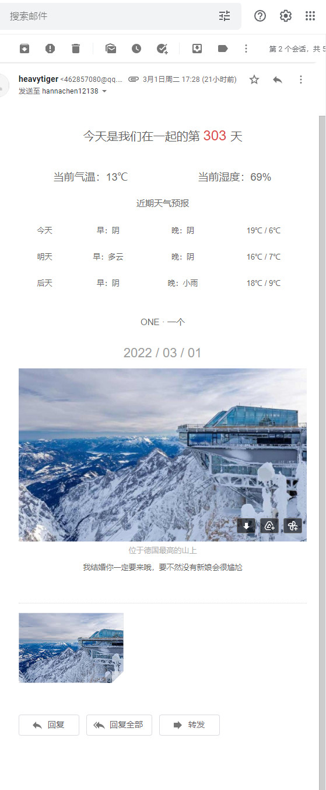
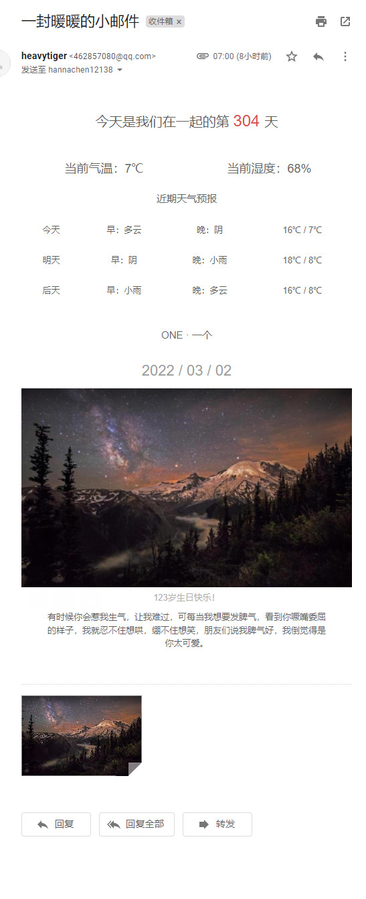

# automail项目

## 项目介绍

该项目使用`SpringBoot`开发，共耗时一天，其目的是每天给女朋友定时发送一份邮件，这就是理工男对女朋友表达爱意的方式(啊吧啊吧)

项目开发的时候我也认为不该用`SpringBoot`开发，直接使用`Python`开发会省力很多，只需要开发完成后每天用`crontab`命令定时执行即可，但是考虑到以后工作中也有可能使用`SpringBoot`给客户发送邮件，就权当练手了，哈哈。

以下是项目的特色：

* 项目会每天爬取`bing`的每日一图，将图片附到邮件中，并且还将以附件的方式发送1080p的原图。

* 项目会发送优质文案(使用`python`爬取优质文案，存放在数据库中，理论上不会重复)。
* 项目会调用百度的天气API，获取相关的天气信息。
* 项目的逻辑很简单，如果你会使用`SpringBoot`，能够轻易进行定制，并且修改代码使其通用性更强。

## 项目效果展示

这个html样式是跟着[Vincedream/NodeMail: 💗 用Node写一个爬虫脚本每天定时给女朋友发一封暖心邮件 (github.com)](https://github.com/Vincedream/NodeMail)中的`ejs`文件薅下来的，因为我不太会前端，只是稍微修改了一下。

